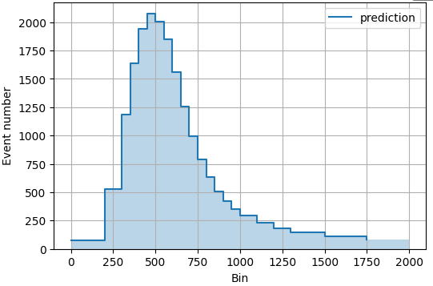
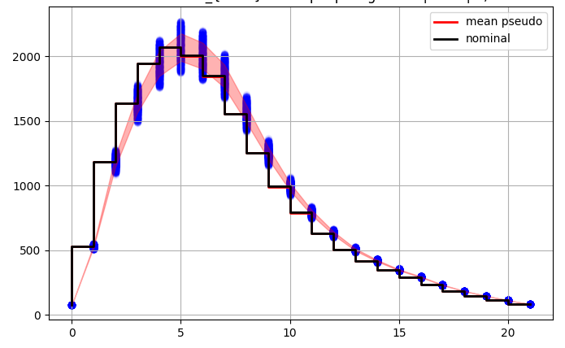
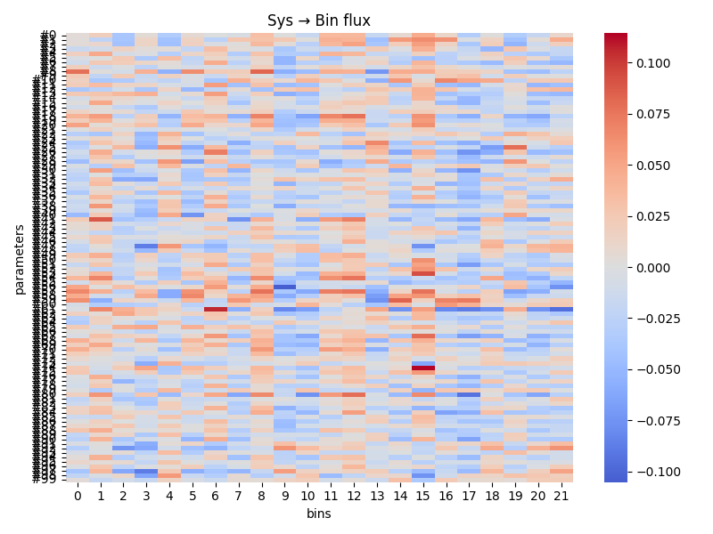
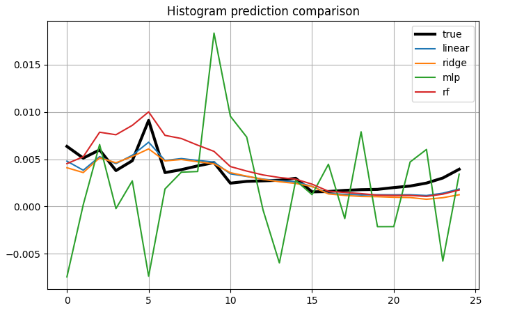
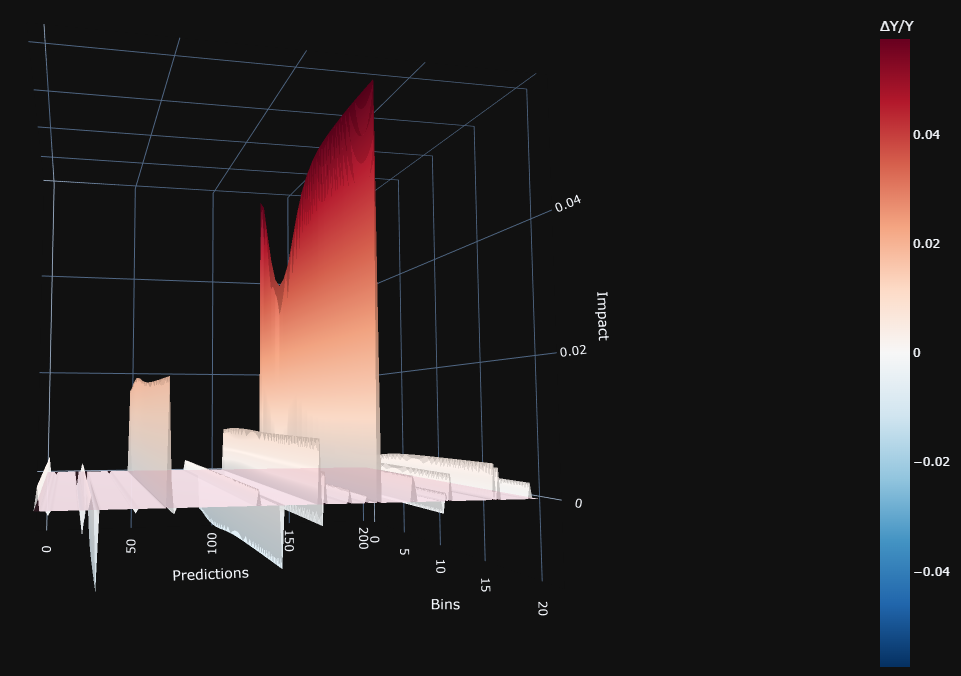
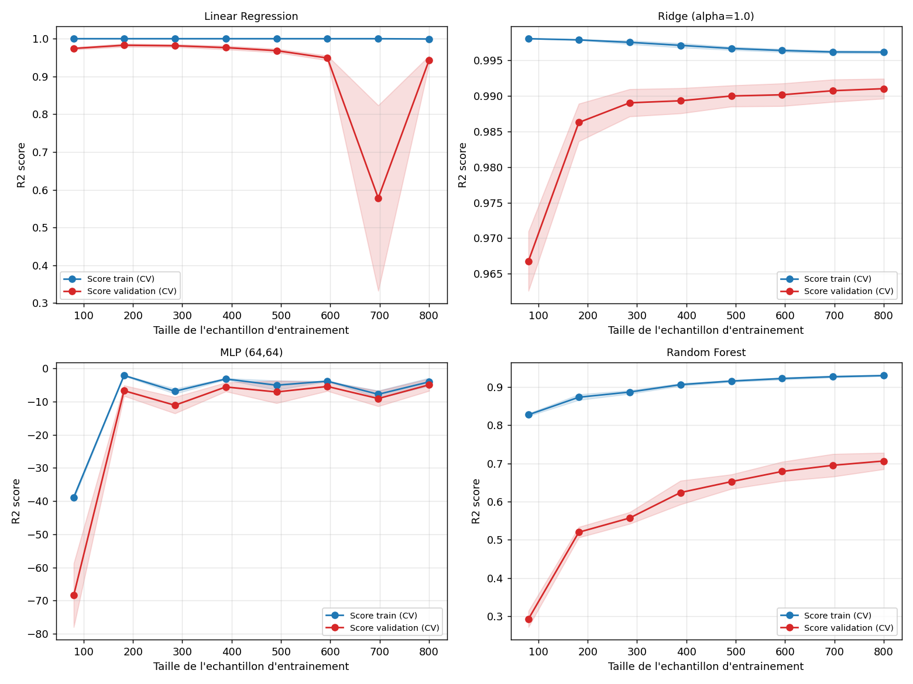

## Introduction

In neutrino oscillation analyses (as T2K experiment pipeline), experimental measurements depend on systematic uncertainties that affect both the normalization and shape of observed distributions (momentum, angle).

A major challenge in such analyses is the propagation of flux, cross-section, and detector systematics from the near detector to the far detector through a high-dimensional covariance matrix.

This process is computationally expensive and requires extensive validation using frequentist and Bayesian fitting approaches, including likelihood scans, pre-/post-fit comparisons, and closure tests. 

I thought about alternatives to visualize and measure the weight of each of the parameter systematics on energy and angular distribution bins. 

## Motivation

While these validation steps are essential, they are time-consuming and often leave limited room for deeper interpretation of how individual systematic parameters impact observables.

This project explores alternative approaches to:
- visualize systematic impacts at bin level
- quantify parameter sensitivity
- accelerate interpretation of fit results using machine learning

## Methodology

I study how systematic bestfit variations propagate through physics observables.

Bestfit parameters correspond to nominal nuisance values (e.g. energy scale, detector calibration, resolution effects). Controlled perturbations are applied to simulate realistic systematic deviations.

Then, I trained multiple regression models to approximate the mapping:

Systematic parameters → observable bin content

Models include:
- Linear Regression (baseline linear response)
- Ridge Regression (regularized linear model)
- Random Forest (nonlinear tree-based model)
- Multi-Layer Perceptron (neural approximation of response surface)

This workflow combines:

1. Pseudo-data generation (N=1000),
2. Apply systematic variations
3. Build observable histograms
4. ML training models
5. Correlations
6. Multidimensional visualization (2D, 3D)
7. Bin-by-bin sensitivity estimation

Main goal:

Correlations between systematics,
Sensitivity of observables to parameter shifts,
Inspect nonlinear responses,
Predictive behavior of trained ML models.

## Contributions

- Bin-level systematic sensitivity analysis
- ML-based surrogate modeling of detector response
- Correlation mapping between nuisance parameters and observables
- Fast visualization framework for uncertainty propagation

## Pseudo-data generation

Synthetic datasets are generated by varying systematic parameter bestfit values around the nominal ones.

This allows controlled studies of:

Detector effects
Calibration uncertainties
Shape distortions

## Correlation analysis

The framework computes and visualizes correlations between systematic parameters and observable bins.

Examples include:

Histogram predictions
Correlation HeatMaps
ML models prédictions vs truth
3D plots ML training

Example Outputs

## A/ Prediction histogram

These predictions are based on the pre-existing histograms that I could extract from my inputs. This extraction depends on the input path to access to them. I built this script around a ROOT input file, but one can use its own file format. You will only need to change the way to extract the event numbers from each bin.

## B/ Truth vs Pseudo data prédictions

I generated N pseudo data simulating momentum and angle prediction by sample and reaction, varying the center value around the bestfit value at one sigma range from the nominal predictions. With this script, one can compare the pseudo data prediction and the nominal (truth) one. 

## C/ Correlation Matrices

Because it is a crutial part of experimental analysis, correlation matrices are a must-have. The easiest way to visualize these correlations are using a heatmap. One can produce heatmap of systematic param-param or systematic param-prediction bins correlations.

## D/ ML Prediction Performance

To better understand the relationship between systematic uncertainties and observable bin responses, we train several machine learning models as surrogate functions of the underlying detector response.

In this context, ML is not used as a final predictive tool, but as an efficient approximation of the high-dimensional mapping:

systematic parameters → bin-level observables.

This allows us to:

- interpolate smoothly between discrete systematic configurations
- capture potential nonlinear dependencies between nuisance parameters and histogram bins
- accelerate the construction of correlation heatmaps
- quantify bin-by-bin sensitivity to individual systematics

By comparing different model families (linear models, tree-based methods, and neural networks), we can also assess the degree of nonlinearity present in the systematic response and identify regimes where simple linear assumptions break down.

Overall, ML models act as a diagnostic tool to reveal hidden structure in the propagation of systematic uncertainties across observables. 

## E/ 3D Bin Response

I really like 3D plots. Here one can find tools to produce 3D visualization plots drawing the bin sensitivity for a specific parameter. As a reminder, this script is used calling labels on graphs extracted from the input ROOT file. So One should adapt this part changing the paths to access to the concerned graphs. 

## F/ Learning curves — model diagnostics

Learning curves plot the R² score (prediction quality, 1 = perfect) as a function of training-sample size, for both the training set in blue and a cross-validation set (red, shaded band = variance across folds). This is the key diagnostic to decide whether a model needs more data, more regularization, or a different architecture — and, ultimately, which surrogate is trustworthy enough to use for systematic-propagation studies.

**Linear Regression** — Training R² is pinned at 1.0 for every sample size: the model fits the training data exactly. Validation R² is good for small samples (~0.97-0.98) but collapses sharply around N=700 (R² ≈ 0.58, variance band spanning 0.33-0.83) before recovering at N=800. This instability is the classic signature of an unregularized linear model struggling with collinearity between systematic parameters (several flux/cross-section systematics are correlated by construction): a single unlucky cross-validation (CV on plots) fold is enough to destabilize the fitted coefficients.

**Ridge Regression (alpha=1.0)** — Well-behaved curve: training R² around 0.996-0.998, validation R² rising smoothly from 0.967 to 0.991, with the train/validation gap narrowing and a tight variance band. This confirms that L2 regularization stabilizes the linear model against the collinearity seen above. Ridge is the best-performing and most stable model in this comparison — it suggests the underlying systematic → bin-content mapping is close to quasi-linear.

**MLP (64,64)** — R² is negative across the board, including -39 (train) / -68 (validation) at N=80: the network performs worse than simply predicting the mean. Performance improves somewhat around N=180 (-2/-7) then plateaus around -5/-10. This is not primarily a data-noise issue but a training/configuration one: likely insufficient epochs, missing input/output normalization, or a network with too much capacity relative to the available sample size (N=1000). It shows a high-capacity model is not automatically better, and currently needs tuning (feature scaling, learning-rate schedule, regularization) before being usable as a surrogate.

**Random Forest** — Training R² climbs from 0.83 to 0.93 while validation R² climbs more slowly from 0.29 to 0.71: a large train/validation gap typical of unconstrained-depth trees memorizing the training set. Validation performance keeps improving with more data, suggesting more samples and/or hyperparameter tuning (max_depth, min_samples_leaf, n_estimators) would help — but even at N=800 it remains well below Ridge.

**Takeaway**: given the current dataset size (N=1000), a regularized linear model (Ridge) is the most robust and interpretable surrogate for this systematic-propagation problem, while tree-based and neural models need more data and/or tuning before they can be trusted for the same task. Axis scales differ substantially between the four panels (e.g. 0.3-0.9 for Random Forest vs. 0.96-1.0 for Ridge), so the plots should be compared on values, not just visual shape.

What will you need ?

Python
NumPy
Pandas
Matplotlib
Scikit-learn
SciPy
ipywidgets
Jupyter Notebook

Modern analyses often rely on large numbers of nuisance parameters and systematic uncertainties as Particle Detection Large experiments around the world (T2K, Dune, NoVa, Super-Kamiokande)

This project aims to provide:

An interpretable visual diagnostics,
A fast ML-assisted evaluations,
and flexible tools for uncertainty propagation studies.

## Author:

Léna Osu
PhD particle physics, LLR Polytechnique Paris

This repository is intended for research and development purposes only.

The distributed code does not contain large-scale collaboration datasets or confidential analysis material. Small example inputs and pseudo-data are included solely for testing and demonstration purposes.

Parts of the implementation and documentation were assisted using AI coding tools.
